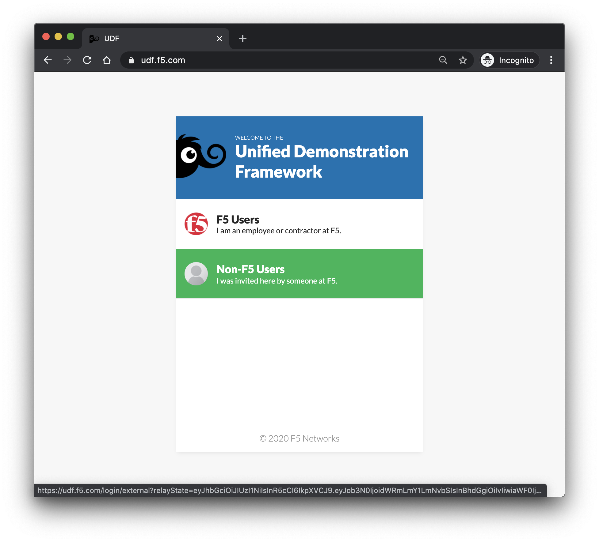
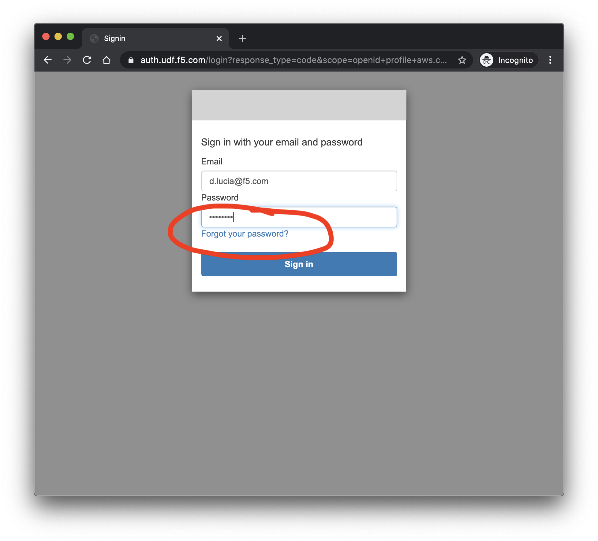
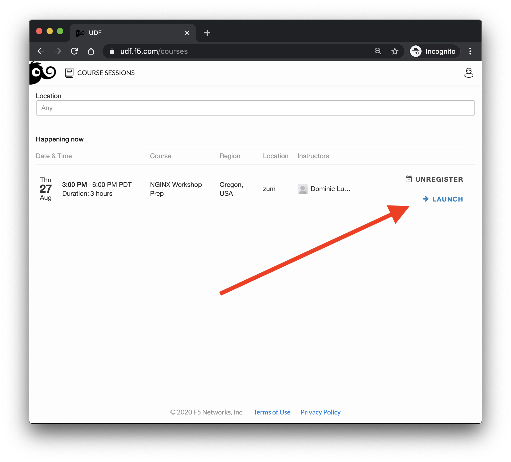
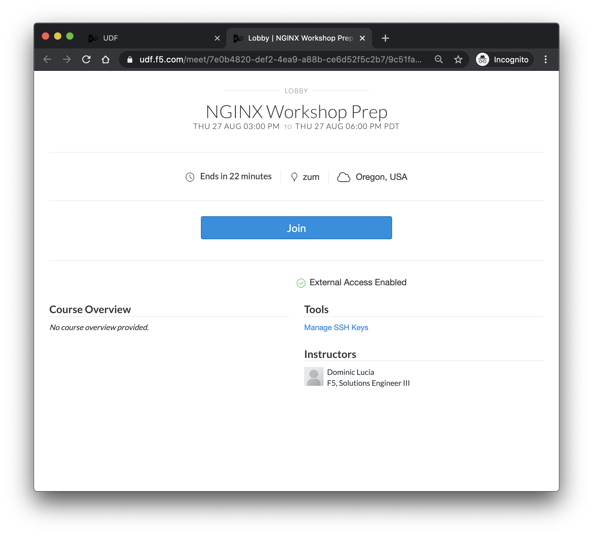
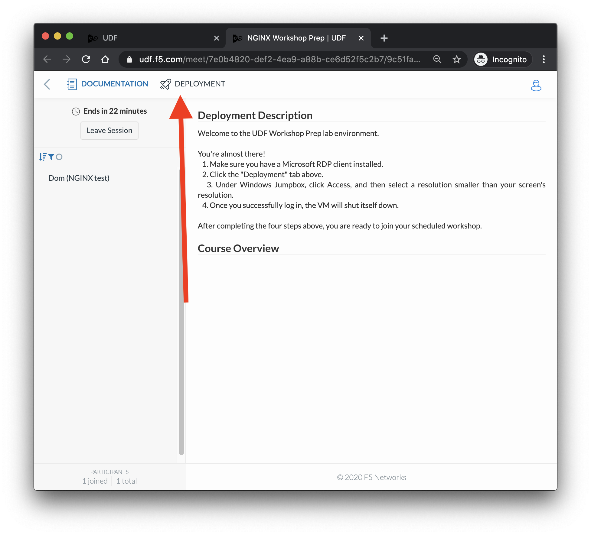
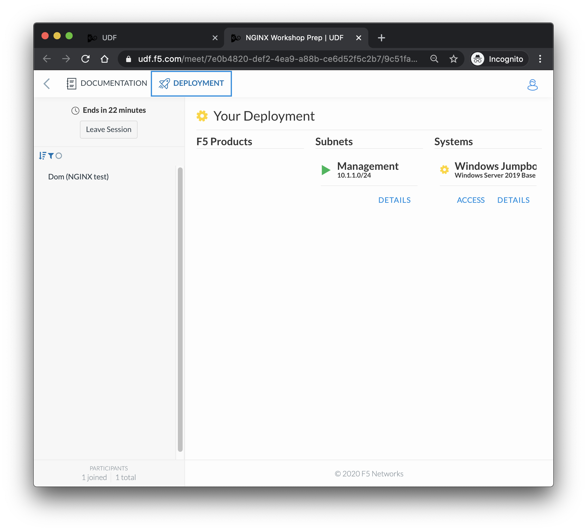
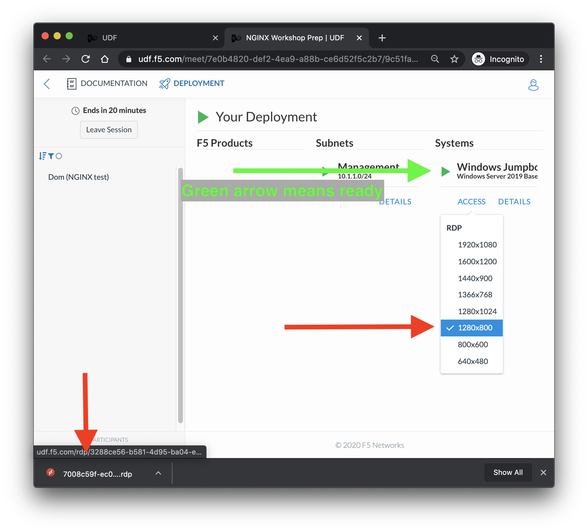
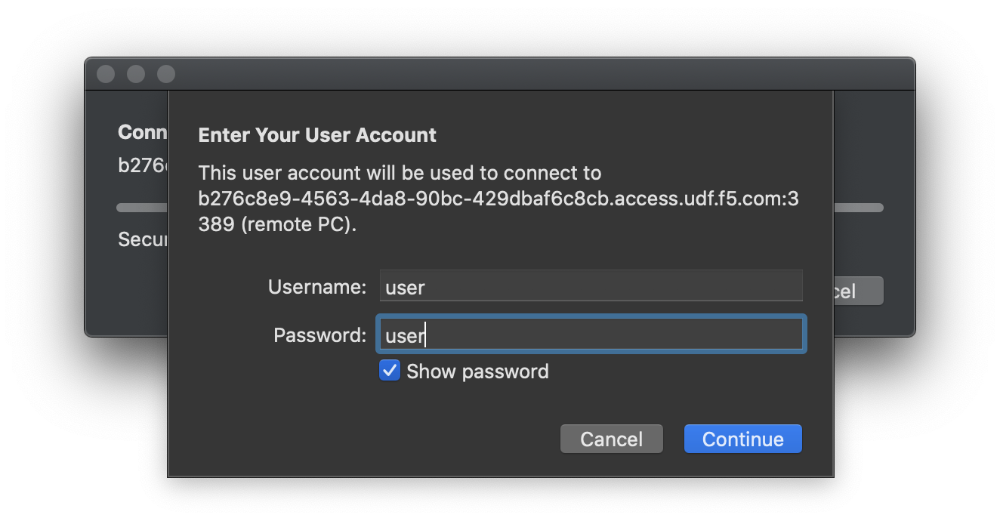

# NGINX Workshop pre-work
## Prep for your upcoming F5/NGINX workshop! 

If you're here that probably means you are registered for an upcoming NGINX workshop. By taking the time to run through this exercise you are helping us save time during the workshop- we appreciate it.

### Step 1: Get yourself to UDF
Navigate to https://udf.f5.com/ and select ```Non-F5 Users```


If this is your first time using UDF, you should have an email with a temporary password. Use that to login to UDF, but this will *not be the password to the VMs in the class!*. 

If you already have an account but you can't remember your password, simply reset it using your corporate email that you used to register for the workshop.


### Step 2: Get into the test course
Click ```Launch``` (This will open a new tab.)


And then ```Join```


Click the ```DEPLOYMENT``` tab at the top


### Step 3: RDP to the Jumping box
THIS REQUIRES AN RDP CLIENT! If you have a Mac *and* haven't downloaded an RDP client before, here is the first-party version:

[Microsoft's RDP client on the Apple Apps Store](https://apps.apple.com/us/app/microsoft-remote-desktop/id1295203466?mt=12)

Now we just have to wait for the Jumpbox to finish booting. . .


Make sure to select a small enough resolution to see the whole screen.


Accept the self-signed cert, and your username and password will be `user` and `user`! (This is *not* your email & UDF password.)

